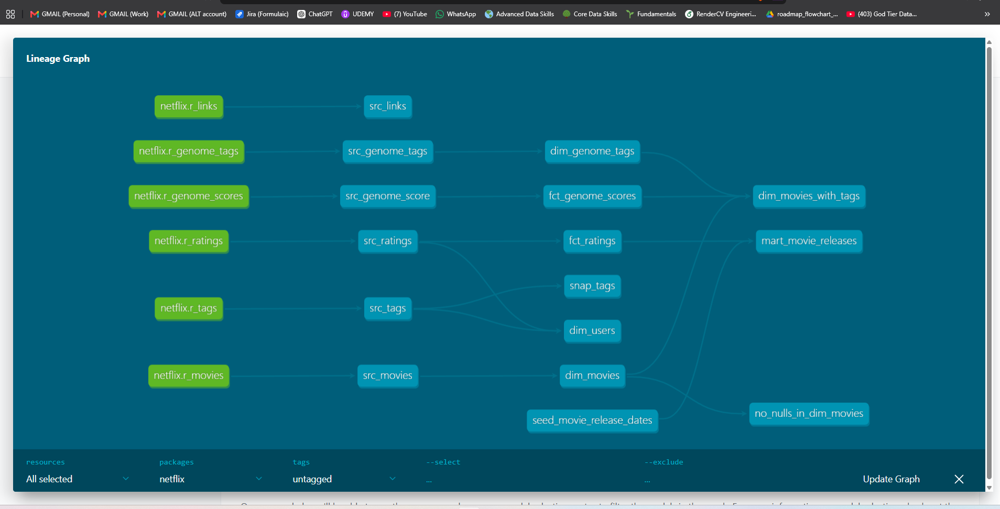

# Netflix / MovieLens dbt + Snowflake Project

An analytics-engineering project that transforms the MovieLens ("Netflix") dataset
into a layered Snowflake warehouse using **dbt**. Raw CSVs are loaded into Snowflake,
then transformed through staging → dimensions → facts → mart, with a seed, a snapshot
(SCD2), a custom test macro, sources, tests, and generated lineage docs.

Built as a hands-on learning project. Companion to an earlier S3 + Snowflake + dbt +
Airflow pipeline and an AWS medallion ETL pipeline. Where those went **wide** (many
tools end to end), this one goes **deep on dbt**: snapshots, seeds, macros, sources,
and docs/lineage.

## Architecture

```
CSV files ─► Snowflake RAW ─► dbt staging (views) ─► dim (tables) ─┐
                                                     fct (tables)  ├─► mart (table)
                                                                   │
src_tags ─► snap_tags (SCD2 snapshot)       seed_movie_release_dates (seed) ─┘
```

| Layer      | dbt folder        | Materialization    | Purpose                                    |
|------------|-------------------|--------------------|--------------------------------------------|
| Raw        | (Snowflake `RAW`) | table (loaded)     | Data as-loaded from CSV                     |
| Staging    | `models/staging`  | view (2 as table)  | Rename + light typing over raw              |
| Dimension  | `models/dim`      | table / ephemeral  | Descriptive entities (movies, users, tags)  |
| Fact       | `models/fct`      | table / incremental| Events (ratings, genome scores)             |
| Mart       | `models/mart`     | table              | Business-facing output (movie releases)     |

Extra dbt features exercised:
- **Sources** — all 6 raw tables declared in `sources.yml`; every staging model reads
  via `source()` so lineage traces back to raw for every path.
- **Seed** — `seed_movie_release_dates.csv` loaded with `dbt seed`.
- **Snapshot** — `snap_tags` tracks tag history as **SCD Type 2**.
- **Custom macro** — `no_nulls_in_columns` powers a singular null-check test.
- **dbt_utils** — `generate_surrogate_key` for the snapshot's `row_key`.
- **Docs / lineage** — `dbt docs generate` + `serve` renders the full DAG.

## Data model (DAG)

```
r_movies ───────► src_movies ──────► dim_movies ─────────────────┐
r_links ────────► src_links                                      │
r_ratings ──────► src_ratings ──┬──► fct_ratings ──┐             ├─► dim_movies_with_tags (ephemeral)
                                └──► dim_users      │             │
r_tags ─────────► src_tags ─────┴──► (dim_users)    │             │
                                └──► snap_tags(SCD2) │             │
r_genome_tags ──► src_genome_tags ─► dim_genome_tags │             │
r_genome_scores ► src_genome_score ► fct_genome_scores┘────────────┘

fct_ratings + seed_movie_release_dates ─► mart_movie_releases
```

## Tech stack

- **Snowflake** (free trial, `COMPUTE_WH` X-SMALL, auto-suspend 60s)
- **dbt-snowflake 1.9.0** (dbt-core 1.10.x; dbt is free — only Snowflake compute costs credits)
- **Python** virtualenv
- Data loaded **directly** into Snowflake (no S3 / no AWS)
- **Key-pair authentication** for the dbt → Snowflake connection

## Key design decisions

- **Direct load, no S3** — avoids AWS and keyless/stored-key management. The reference
  loaded from an S3 stage with blank AWS keys; we sidestep that entirely.
- **Truncated dataset** — full `ml-latest` is ~1.5 GB (ratings 890 MB, genome-scores
  497 MB). Loaded a slice (ratings 500k, genome-scores 1M, tags 200k; movies/links/
  genome-tags in full) to keep runtime and credits near $0 while exercising every model.
- **Key-pair auth** — password login for the `dbt` user kept failing; key-pair is the
  recommended method for a service user and bypasses password policies. See gotchas.
- **`source()` everywhere** — the reference only used `source()` in one staging model;
  using it in all six gives complete lineage.
- **`unique` tests left commented** — raw MovieLens does not guarantee uniqueness on
  the keys, so asserting it would fail. Left in `schema.yml` as documented intent.
- **Seed dates are synthetic** — `seed_movie_release_dates.csv` holds generated dates
  for movie_ids 1–600, enough to demonstrate the seed join (known vs unknown).

## Gotchas worth remembering

- **Snowflake `CREATE USER IF NOT EXISTS`** skips the whole statement if the user
  exists — so a second run does NOT update the password. Use `ALTER USER` to change it.
- **`LEGACY_SERVICE` / `SERVICE` user types** are blocked from password login on
  current Snowflake accounts. Use `TYPE = PERSON` (or key-pair) for dbt.
- **Key-pair / JWT auth needs the ORG-ACCOUNT account identifier** (e.g. `ABCDORG-XY12345`),
  NOT the dotted region form (`xy12345.region.cloud`). The dotted form gives
  `JWT token is invalid`. Find yours: `SELECT CURRENT_ORGANIZATION_NAME(), CURRENT_ACCOUNT_NAME();`
- **`ROWS` is a reserved word** in Snowflake — can't be a bare column alias.
- **Run dbt from the `netflix/` subfolder** (where `dbt_project.yml` lives).

## Security

- `~/.dbt/profiles.yml`, the RSA private key, and `.env` are git-ignored; never committed.
- `profiles.example.yml` and `.env.example` show the shape with placeholders.
- No hardcoded credentials or keys in any committed file.
- Data CSVs are not committed (`.gitignore`); only the small seed CSV is.

## Setup / run

```powershell
# 1. Environment
python -m venv venv
.\venv\Scripts\Activate.ps1
pip install dbt-snowflake==1.9.0

# 2. Snowflake (browser worksheet, as ACCOUNTADMIN)
#    Run snowflake/01_setup.sql, then 02_raw_tables.sql.
#    Load the 6 CSVs into MOVIELENS.RAW (Snowsight Ingestion UI or SnowSQL).

# 3. Key-pair auth
#    openssl genrsa 2048 | openssl pkcs8 -topk8 -inform PEM -out dbt_key.p8 -nocrypt
#    openssl rsa -in dbt_key.p8 -pubout -out dbt_key.pub
#    ALTER USER dbt SET RSA_PUBLIC_KEY='<public key body, one line>';
#    Point ~/.dbt/profiles.yml at dbt_key.p8 (see profiles.example.yml).

# 4. Build (run from the netflix/ folder)
cd netflix
dbt deps
dbt debug          # should say: All checks passed!
dbt seed
dbt run
dbt snapshot
dbt test
dbt docs generate && dbt docs serve   # lineage graph at http://localhost:8080
```

## Repository layout

```
.
├── snowflake/            # 01_setup.sql, 02_raw_tables.sql, 03_load.sql
├── netflix/              # the dbt project
│   ├── dbt_project.yml
│   ├── packages.yml      # dbt_utils 1.3.0
│   ├── models/
│   │   ├── staging/      # sources.yml + 6 src_* models
│   │   ├── dim/          # dim_movies, dim_users, dim_genome_tags, dim_movies_with_tags
│   │   ├── fct/          # fct_ratings (incremental), fct_genome_scores
│   │   ├── mart/         # mart_movie_releases
│   │   └── schema.yml    # tests + descriptions
│   ├── seeds/            # seed_movie_release_dates.csv
│   ├── snapshots/        # snap_tags.sql (SCD2)
│   ├── macros/           # no_nulls_in_columns.sql
│   ├── tests/            # no_nulls_in_dim_movies.sql (uses the macro)
│   └── analyses/         # movie_analysis.sql (compiled, not materialized)
├── profiles.example.yml  # key-pair profile shape (no secrets)
├── .env.example
└── .gitignore
```

## Results

- Raw loaded: movies 86,537 · ratings 500,000 · tags 200,000 · genome-scores 1,000,000
  · genome-tags 1,128 · links 86,537.
- `dbt build` artifacts in `MOVIELENS.DEV`; snapshot in `MOVIELENS.SNAPSHOTS`.
- `dbt test` → 13 tests pass (not_null, relationships, custom no-nulls macro).
- SCD2 verified live: editing one tag's timestamp produced a second versioned row
  (old version `dbt_valid_to` closed, new version `dbt_valid_to = NULL`).
- `mart_movie_releases`: 78,523 ratings with known release date, 421,477 unknown.

## Cost

dbt is free. Only Snowflake compute (credits) costs money. The full build runs in
seconds on an X-SMALL warehouse with 60s auto-suspend, so total consumption is a tiny
fraction of the trial's 400 credits. See `snowflake/99_teardown.sql` for cleanup.

## Lineage

The full DAG, generated by `dbt docs`, traces every model from raw sources through
staging, dimensions, and facts to the mart (plus the snapshot and seed):



Because every staging model reads via `source()`, all six raw tables connect through
to the downstream models — nothing floats disconnected.

## What I learned

The dbt features this project exists to go deep on:

- **Materializations are a design choice, not a default.** Views for cheap staging
  pass-throughs; tables for dimensions read repeatedly; **incremental** for the ratings
  fact so re-runs only append new rows (watched it go from a full build to a 0-row
  append via the `is_incremental()` timestamp watermark); **ephemeral** for
  `dim_movies_with_tags`, which creates no warehouse object and is inlined as a CTE.
- **Snapshots capture history (SCD Type 2).** A normal table only shows the current
  state; a snapshot keeps a new versioned row each time a record changes, stamped with
  `dbt_valid_from` / `dbt_valid_to`. Verified it live by editing one tag's timestamp
  and watching the old version close and a new one open.
- **Seeds** version-control small static lookups (release dates) and load with `dbt seed`.
- **Sources + `ref()`** build the dependency DAG. Using `source()` in *all* staging
  models (not just one) is what makes lineage trace cleanly back to raw.
- **Custom macros** keep tests DRY — `no_nulls_in_columns` loops a relation's columns
  at compile time to null-check them all at once.
- **Tests encode trust** — `not_null`, `relationships` (referential integrity between
  fact and dim), and the custom macro test. `unique` was intentionally left commented
  where the data does not guarantee it, rather than asserting a false constraint.

Snowflake / tooling gotchas worth remembering (each cost real debugging time):

- `CREATE USER IF NOT EXISTS` silently skips password updates on a re-run — use `ALTER USER`.
- `LEGACY_SERVICE` / `SERVICE` user types are blocked from password login on current
  accounts — use `TYPE = PERSON`, or key-pair auth (which this project uses).
- Key-pair / JWT auth needs the **ORG-ACCOUNT** identifier, not the dotted region form,
  or you get `JWT token is invalid`.
- `ROWS` is a reserved word in Snowflake and can't be a bare column alias.
